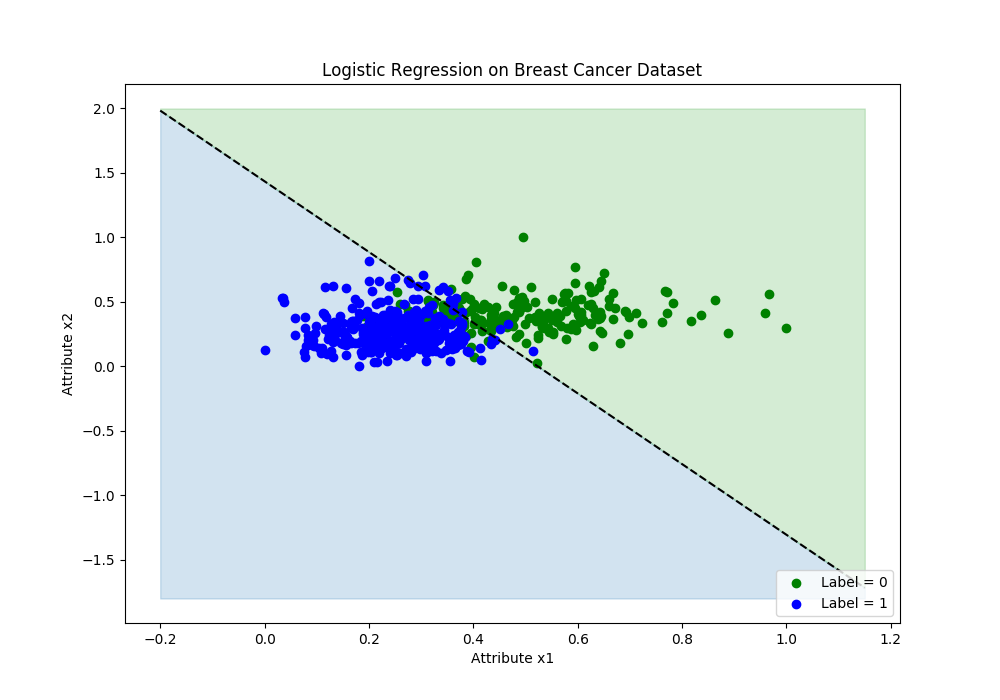

## Unregularized Logistic Regression
**Accuracies on Breast Cancer Dataset (using Formula vs Autograd)**

    Accuracy using Formula:  0.9349736379613357

    Accuracy using Autograd 0.9349736379613357

**Accuracy for K=3 folds on Breast Cancer Dataset**

    Test fold 1:  0.8888888888888888

    Test fold 2:  0.9523809523809523

    Test fold 3:  0.9470899470899471

    Average accuracy:  0.9294532627865961

### Decision Boundary

