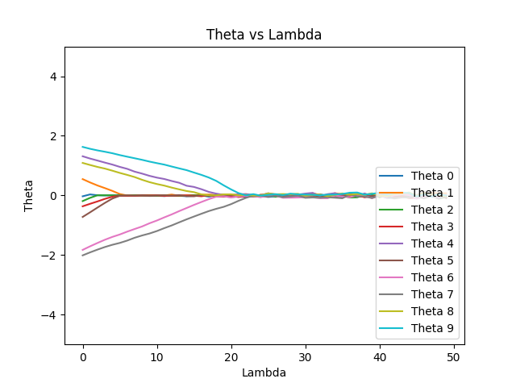

## Logistic Logistic Regression
**5 Fold Nested Cross Validation for calculating optimal penalty term for L2 and L1 Regularisation**

    Outer Fold 1: 
            Inner Fold 1: 
                    L1 Lambda = 0.20:  0.9
                    L2 Lambda = 0.40:  0.8888888888888888
            Inner Fold 2: 
                    L1 Lambda = 0.40:  0.9333333333333333
                    L2 Lambda = 0.80:  0.9111111111111111
            Inner Fold 3: 
                    L1 Lambda = 0.60:  0.9888888888888889
                    L2 Lambda = 1.20:  0.9777777777777777
            Inner Fold 4: 
                    L1 Lambda = 0.80:  0.9777777777777777
                    L2 Lambda = 1.60:  0.9777777777777777
            Inner Fold 5: 
                    L1 Lambda = 1.00:  0.9555555555555556
                    L2 Lambda = 2.00:  0.9555555555555556
            Best L1 Lambda for Outer Fold 1: 0.60
            Test accuracy using L1 Lambda = 0.60:  0.8584070796460177
            Best L2 Lambda for Outer Fold 1: 1.20
            Test accuracy using L2 Lambda = 1.20:  0.8495575221238938
    Outer Fold 2: 
            Inner Fold 1: 
                    L1 Lambda = 0.20:  0.8222222222222222
                    L2 Lambda = 0.40:  0.8
            Inner Fold 2: 
                    L1 Lambda = 0.40:  0.9222222222222223
                    L2 Lambda = 0.80:  0.9111111111111111
            Inner Fold 3: 
                    L1 Lambda = 0.60:  0.9777777777777777
                    L2 Lambda = 1.20:  0.9777777777777777
            Inner Fold 4: 
                    L1 Lambda = 0.80:  0.9777777777777777
                    L2 Lambda = 1.60:  0.9777777777777777
            Inner Fold 5: 
                    L1 Lambda = 1.00:  0.9666666666666667
                    L2 Lambda = 2.00:  0.9666666666666667
            Best L1 Lambda for Outer Fold 2: 0.60
            Test accuracy using L1 Lambda = 0.60:  0.911504424778761
            Best L2 Lambda for Outer Fold 2: 1.20
            Test accuracy using L2 Lambda = 1.20:  0.9026548672566371
    Outer Fold 3: 
            Inner Fold 1: 
                    L1 Lambda = 0.20:  0.8777777777777778
                    L2 Lambda = 0.40:  0.8555555555555555
            Inner Fold 2: 
                    L1 Lambda = 0.40:  0.9333333333333333
                    L2 Lambda = 0.80:  0.9222222222222223
            Inner Fold 3: 
                    L1 Lambda = 0.60:  0.9555555555555556
                    L2 Lambda = 1.20:  0.9333333333333333
            Inner Fold 4: 
                    L1 Lambda = 0.80:  0.9555555555555556
                    L2 Lambda = 1.60:  0.9555555555555556
            Inner Fold 5: 
                    L1 Lambda = 1.00:  0.9555555555555556
                    L2 Lambda = 2.00:  0.9555555555555556
            Best L1 Lambda for Outer Fold 3: 0.60
            Test accuracy using L1 Lambda = 0.60:  0.9557522123893806
            Best L2 Lambda for Outer Fold 3: 1.60
            Test accuracy using L2 Lambda = 1.60:  0.9469026548672567
    Outer Fold 4: 
            Inner Fold 1: 
                    L1 Lambda = 0.20:  0.9
                    L2 Lambda = 0.40:  0.9
            Inner Fold 2: 
                    L1 Lambda = 0.40:  0.9111111111111111
                    L2 Lambda = 0.80:  0.9222222222222223
            Inner Fold 3: 
                    L1 Lambda = 0.60:  0.9111111111111111
                    L2 Lambda = 1.20:  0.9111111111111111
            Inner Fold 4: 
                    L1 Lambda = 0.80:  0.9666666666666667
                    L2 Lambda = 1.60:  0.9666666666666667
            Inner Fold 5: 
                    L1 Lambda = 1.00:  0.9777777777777777
                    L2 Lambda = 2.00:  0.9666666666666667
            Best L1 Lambda for Outer Fold 4: 1.00
            Test accuracy using L1 Lambda = 1.00:  0.9734513274336283
            Best L2 Lambda for Outer Fold 4: 1.60
            Test accuracy using L2 Lambda = 1.60:  0.9823008849557522
    Outer Fold 5: 
            Inner Fold 1: 
                    L1 Lambda = 0.20:  0.9111111111111111
                    L2 Lambda = 0.40:  0.9
            Inner Fold 2: 
                    L1 Lambda = 0.40:  0.9222222222222223
                    L2 Lambda = 0.80:  0.9333333333333333
            Inner Fold 3: 
                    L1 Lambda = 0.60:  0.9444444444444444
                    L2 Lambda = 1.20:  0.9444444444444444
            Inner Fold 4: 
                    L1 Lambda = 0.80:  0.9777777777777777
                    L2 Lambda = 1.60:  0.9777777777777777
            Inner Fold 5: 
                    L1 Lambda = 1.00:  0.9555555555555556
                    L2 Lambda = 2.00:  0.9666666666666667
            Best L1 Lambda for Outer Fold 5: 0.80
            Test accuracy using L1 Lambda = 0.80:  0.9646017699115044
            Best L2 Lambda for Outer Fold 5: 1.60
            Test accuracy using L2 Lambda = 1.60:  0.9557522123893806

### Variation of Theta with Lambda in L1 Regularisation

+ We observe that some Theta's converge to 0 later than the others. This suggests that these thetas are more important than the others.
+ For Example: Theta 9 and 8 seem to converge later than the rest. Hence, we can say that they are more 'important' than other features.
