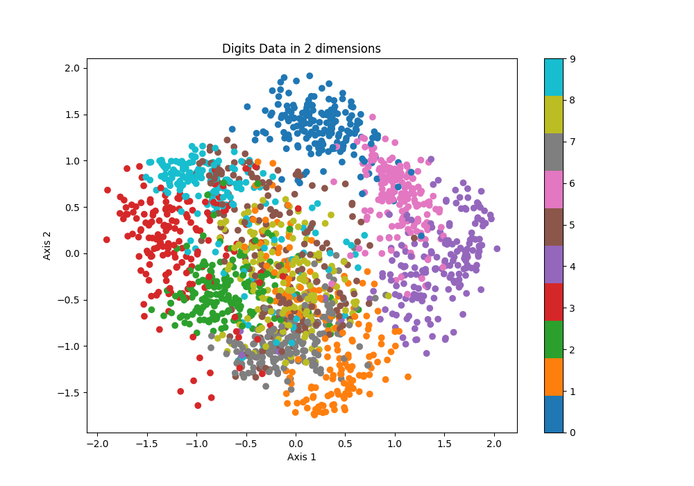

## K-Class Logistic Regression
**Digits Dataset using Stratified 4 Folds Accuracy**

        Test fold 1:  0.9488888888888889
        Test fold 2:  0.9020044543429844
        Test fold 3:  0.9688195991091314
        Test fold 4:  0.9086859688195991
        Average accuracy:  0.9320997277901509

### Digits Dataset - Confusion Matrix

        [[44  0  0  0  0  0  0  0  0  0]
        [ 0 44  0  0  0  0  1  0  1  0]
        [ 0  0 44  0  0  0  0  0  0  0]
        [ 0  0  0 45  0  0  0  1  0  0]
        [ 1  0  0  0 41  0  3  0  0  0]
        [ 0  0  0  0  0 43  0  0  0  3]
        [ 0  0  0  0  0  0 45  0  0  0]
        [ 0  0  0  0  0  0  0 45  0  0]
        [ 0  2  0  0  0  1  0  1 39  0]
        [ 0  0  0  0  0  0  0  0  0 45]]

+ Using the confusion matrix, we can observe that the model gets confused between (9 and 5) and (4 and 6) as the entries (4,6) and (5, 9) are 3 which means the model wrongly predicted them 3 times 
+ The model finds 3 to be the easiest to predict, as it does not have any false positives or false negatives.

### Digits Dataset in 2D using PCA

